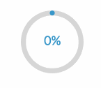

# pomodoro-app

## Table of Contents

- [Prerequisites](#Prerequisites)
- [Tech Stack](#TechStack)
- [Getting Started](#GettingStarted)
- [Project Structure](#ProjectStructure)
- [Deployment](#Deployment)
- [Author](#Author)

## Prerequisites

Before you begin, ensure you have met the following requirements:

-  \_npm @ 10.5.0\_
-  \_vite @ 5.1.4\_
-  \_typescript @ 5.2.2\_

## Tech Stack

-  \_React @18.2.0 - front-end framework\_
-  \_React @18.2.0 - Styled-components @6.1.8- visual primitives for the component age\_
-  \_React Circular Bar @2.1.0 - visually represent data values in a circular or radial format\_

## Getting Started

```bash
git clone https://github.com/gura16/pomodoro-app.git

npm install

npm run dev

```
